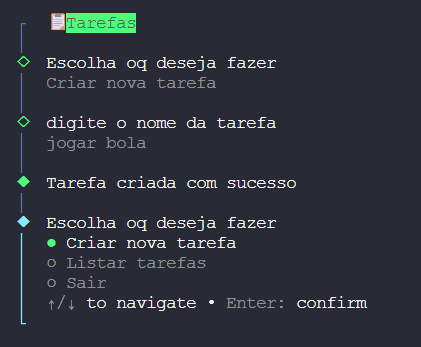
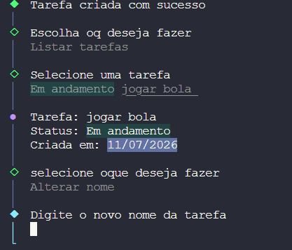

# 📋 DailyTasks

Um gerenciador de tarefas simples e direto, feito para rodar no terminal. Sem distrações, sem abrir o navegador — só você, seu terminal e suas tarefas do dia.


## ✨ Funcionalidades

- ✅ Criar novas tarefas
- 📃 Listar todas as tarefas cadastradas
- 🔄 Atualizar o status de uma tarefa (_Em andamento_, _Concluída_, _Cancelada_)
- ✏️ Renomear tarefas existentes
- 🗑️ Deletar tarefas
- 💾 Persistência local em arquivo `tasks.json` — suas tarefas continuam lá mesmo depois de fechar o terminal

## 🖥️ Preview

**Criando uma tarefa:**



**Listando e visualizando uma tarefa:**



## 🚀 Como rodar

Clone o repositório e instale as dependências:

```bash
git clone https://github.com/JonnyMarcus/DailyTasks.git
cd DailyTasks
npm install
```

Inicie o app:

```bash
npm start
```

## 🛠️ Tecnologias

- [Node.js](https://nodejs.org/) — ambiente de execução
- [@clack/prompts](https://github.com/bombshell-dev/clack) — interface interativa de terminal
- [chalk](https://github.com/chalk/chalk) — cores e estilos no terminal

## 📁 Estrutura do projeto

```
DailyTasks/
├── src/
│   ├── index.js           # ponto de entrada da aplicação
│   ├── manager/
│   │   └── tasks.js       # lógica de CRUD das tarefas + persistência
│   └── menus/
│       ├── main.js        # menu principal
│       ├── create.js      # menu de criação de tarefa
│       ├── list.js        # menu de listagem de tarefas
│       └── update.js      # menu de edição/status/exclusão
├── tasks.json             # banco de dados local (criado automaticamente)
├── package.json
└── README.md
```

## 📝 Como funciona por baixo dos panos

As tarefas ficam guardadas em `tasks.json`, na raiz do projeto. Esse arquivo é criado automaticamente na primeira execução, caso ainda não exista. Cada tarefa segue este formato:

```json
{
  "name": "Estudar Node.js",
  "status": "Em andamento",
  "createdAt": "2026-07-11T14:30:00.000Z"
}
```

## 🗺️ Ideias futuras

- [ ] Editar a data de vencimento de uma tarefa
- [ ] Filtrar tarefas por status
- [ ] Exportar tarefas para outro formato (CSV, PDF)

## 👤 Autor

Feito por [Jonny Marcus](https://github.com/JonnyMarcus)

## 📄 Licença

Este projeto está sob a licença ISC.
